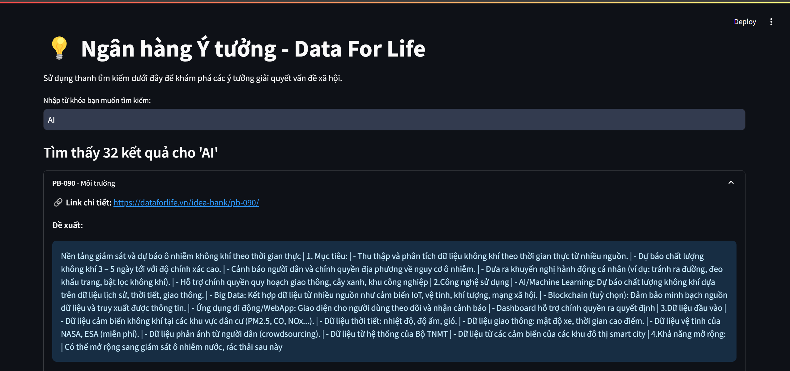

# 💡 Idea Bank - Data For Life

A web application built with Streamlit to search and explore ideas from the contest **"Data for Life"** organized by the Ministry of Public Security.



## 📌 Introduction

This project consists of two main components:
1.  **A data collection script (crawler)**: Automatically fetches all idea information from the idea-bank of [Data For Life](https://dataforlife.vn/idea-bank/) and saves it as a CSV file.  
2.  **A web search application**: Provides a user-friendly interface to easily search, filter, and view detailed information about each collected idea.

## ✨ Features

-   **Intuitive Search Interface**: Easily search for ideas by any keyword (e.g., healthcare, transportation, environment, logistics...).  
-   **Detailed View**: Display full information of each idea including proposal, target audience, impact, context… in an expandable/collapsible view.  
-   **Automated Data Collection**: The included script (`scripts/crawl_data.py`) automatically crawls and updates the latest data from the original website.  
-   **Performance Optimization**: Uses Streamlit’s cache to speed up data loading after the first run.  

## 🛠️ Technologies Used

-   **Language**: Python  
-   **Web Framework**: Streamlit  
-   **Data Collection**: Requests, BeautifulSoup4  
-   **Data Processing**: Pandas  

## 📁 Project Structure

```
.
├── data/                  
│   └── CSV_dataset.csv
    └── JSON_dataset.json
├── scripts/
│   └── crawl_data.py      
├── .gitignore            
├── app.py                 
├── LICENSE               
├── README.md              
└── requirements.txt       
```

## 🚀 Installation & Usage

You need to have [Python 3.8+](https://www.python.org/downloads/) installed on your machine.

**1. Clone this repository:**

```bash
git clone https://github.com/hungthikcode/Dataforlife-ideas-search.git
cd YOUR_REPO_NAME
```

**2. (Recommended) Create and activate a virtual environment:**

```bash
# For Windows
python -m venv venv
.venv\Scripts\activate

# For macOS / Linux
python3 -m venv venv
source venv/bin/activate
```

**3. Install required dependencies:**

```bash
pip install -r requirements.txt
```

**4. Run the data collection script:**

The first time you run, you **must** execute this script to generate the file `data/CSV_dataset.csv`.  
Without this file, the application will show an error.

```bash
python scripts/crawl_data.py
```
*Note: This process may take several minutes depending on the number of posts and your internet speed.*  

**5. Launch the Streamlit app:**

```bash
streamlit run app.py
```

After running the above command, a new browser tab will automatically open at `http://localhost:8501`. Now you can start exploring and searching ideas!  

## 📄 License

This project is licensed under the [MIT License](LICENSE). See the `LICENSE` file for more details.
